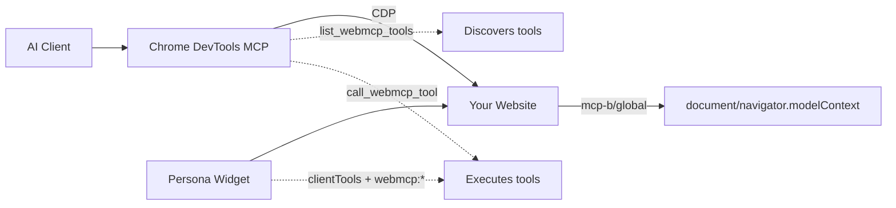
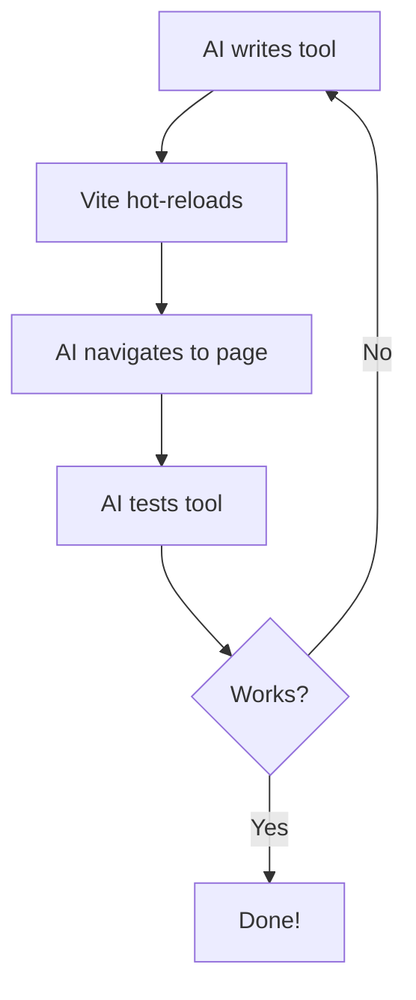

# Chrome DevTools MCP Quickstart + Persona Calendar
> Give AI agents direct access to a calendar app—through Chrome DevTools MCP or an embedded Persona widget—no screenshots, no DOM scraping, just structured tool calls.

## Why This Matters
**Up to 89% fewer tokens** compared to screenshot-based workflows.


## How It Works




1. Your website loads [`@mcp-b/global`](https://www.npmjs.com/package/@mcp-b/global) which adds `document.modelContext` / `navigator.modelContext`
2. The calendar registers tools in [`calendar.js`](./calendar.js) using `modelContext.registerTool()`
3. [Chrome DevTools MCP](https://docs.mcp-b.ai/packages/chrome-devtools-mcp) exposes `list_webmcp_tools` + `call_webmcp_tool`
4. The embedded Persona widget also snapshots those tools with `webmcp.enabled` and can call them as `webmcp:*` tools

---

## Quick Start (3 Steps)

### 1. Clone & Run

```bash
git clone https://github.com/WebMCP-org/chrome-devtools-quickstart.git
cd chrome-devtools-quickstart
npm install
cp .env.example .env.local # fill VITE_PERSONA_CLIENT_TOKEN for the Persona widget
npm run dev
```

### 2. Add MCP Server to Your AI Client

**Claude Code:**
```bash
claude mcp add chrome-devtools npx @mcp-b/chrome-devtools-mcp@latest
```

**Optional:** Add the [WebMCP docs server](https://docs.mcp-b.ai/mcp-integration) so your AI knows how to build tools:
```bash
claude mcp add --transport http webmcp-docs https://docs.mcp-b.ai/mcp
```

<details>
<summary>Cursor, Claude Desktop, Windsurf, Other Clients</summary>

**Cursor** - Add to `.cursor/mcp.json`:
```json
{
  "mcpServers": {
    "chrome-devtools": {
      "command": "npx",
      "args": ["@mcp-b/chrome-devtools-mcp@latest"]
    },
    "webmcp-docs": {
      "url": "https://docs.mcp-b.ai/mcp"
    }
  }
}
```

**Claude Desktop** - Edit `~/Library/Application Support/Claude/claude_desktop_config.json` (macOS):
```json
{
  "mcpServers": {
    "chrome-devtools": {
      "command": "npx",
      "args": ["@mcp-b/chrome-devtools-mcp@latest"]
    },
    "webmcp-docs": {
      "url": "https://docs.mcp-b.ai/mcp"
    }
  }
}
```

**Windsurf** - Add to `mcp_config.json`:
```json
{
  "mcpServers": {
    "chrome-devtools": {
      "command": "npx",
      "args": ["@mcp-b/chrome-devtools-mcp@latest"]
    },
    "webmcp-docs": {
      "command": "npx",
      "args": ["mcp-remote", "https://docs.mcp-b.ai/mcp"]
    }
  }
}
```

</details>

### 3. Test It

Ask your AI:

> "Navigate to http://localhost:5173, list available WebMCP tools, and create a Team Standup tomorrow at 10am."

Or use the prompt bar above the calendar ("Ask your calendar copilot…"). Submitting it slides out the docked Calendar Copilot on the right, hides the manual input controls, and sends your message. Submitting it empty runs the default demo prompt:

> "Create a Team Standup tomorrow at 10am, then verify it appears on the calendar."

The app is intentionally hybrid: the Quick Add form covers mouse-and-keyboard workflows, while the prompt bar is the conversational front door — both drive the same calendar state that the WebMCP tools expose.

**Alternate embedding style:** open [`/?mode=pill`](http://localhost:5173/?mode=pill) to mount Persona as its native bottom composer-bar pill (instead of the docked side panel). Same ten WebMCP tools, different chrome — submitting the pill expands an anchored chat panel over the calendar and minimizes back to the pill on close.

The AI will discover the calendar tools and execute them directly:


---

## Background

[Chrome DevTools MCP](https://github.com/ChromeDevTools/chrome-devtools-mcp/) is an MCP server that gives AI agents full browser automation capabilities—navigation, clicking, typing, screenshots, console access, network inspection, and performance profiling.

[WebMCP](https://github.com/MiguelsPizza/WebMCP) takes this further: instead of AI parsing screenshots or scraping DOM, your website exposes JavaScript functions as structured tools that AI can call directly. The result is faster, cheaper, and more reliable agent interactions.

> [!NOTE]
> **What is WebMCP?**   
>     
> WebMCP turns your website's JavaScript functions into AI-callable tools. Register a function once, and any MCP-compatible AI client can discover and invoke it—with type-safe parameters and structured responses. The protocol is being [standardized through the W3C Web Machine Learning Community Group](https://github.com/webmachinelearning/webmcp).

> [!NOTE]
> **Try it live:** Explore the [Playground](https://usechar.ai) to see WebMCP in action.
> Questions? Reach out: [MiguelsPizza](https://github.com/MiguelsPizza)
 
[](https://discord.gg/a9fBR6Bw)


---

## Example Tools

This quickstart exposes 10 calendar tools in [`calendar.js`](./calendar.js):

| Tool | Description |
|------|-------------|
| `get_page_title` | Returns `document.title` |
| `get_calendar_state` | Returns selected date, visible week, timezone, and visible events |
| `get_events` | Lists events, with optional month/user/search filters |
| `get_users` | Returns valid calendar owners and UUIDs |
| `get_event_colors` | Returns allowed event colors |
| `find_availability` | Finds open workday slots |
| `select_date` | Moves the calendar UI to a date |
| `create_event` | Creates and renders an event |
| `update_event` | Updates an event by ID |
| `delete_event` | Deletes an event by ID |

### Registering a Tool

```javascript
import '@mcp-b/global';  // Must be first!

const modelContext = document.modelContext ?? navigator.modelContext;

modelContext.registerTool({
  name: "get_calendar_state",
  description: "Returns the current calendar state",
  inputSchema: { type: "object", properties: {} },
  annotations: { readOnlyHint: true },
  async execute() {
    return {
      content: [{ type: "text", text: JSON.stringify(getCalendarState()) }]
    };
  }
});
```

### Tool with Parameters

```javascript
modelContext.registerTool({
  name: "create_event",
  description: "Creates a calendar event",
  inputSchema: {
    type: "object",
    properties: {
      title: { type: "string" },
      startDate: { type: "string", description: "ISO date-time" },
      endDate: { type: "string", description: "ISO date-time" },
      userId: { type: "string" },
      color: { type: "string" }
    },
    required: ["title", "startDate", "endDate"]
  },
  async execute(args) {
    const event = createEvent(args);
    return {
      content: [{ type: "text", text: `Created ${event.title}` }]
    };
  }
});
```

**To use in your own project:**
```bash
npm install @mcp-b/global @runtypelabs/persona
```
Then import it before registering tools.

---

## AI Development Loop

The real power: AI writes code, hot-reloads, tests in the browser, and iterates—all without leaving your editor.



**Try it:**
> "Create a WebMCP tool called 'reschedule_event' that moves an event by ID. Add it to calendar.js, then test it."

---

## Available Tools

Chrome DevTools MCP provides 26 browser automation tools across 6 categories:

| Category | Tools |
|----------|-------|
| **Navigation** | `navigate_page`, `go_back`, `go_forward`, `refresh` |
| **Interaction** | `click`, `fill`, `hover`, `press_key`, `drag` |
| **Inspection** | `take_screenshot`, `take_snapshot`, `evaluate_script` |
| **Tabs** | `list_pages`, `select_page`, `new_page`, `close_page` |
| **WebMCP** | `list_webmcp_tools`, `call_webmcp_tool` |

---

## Other Ways to Call WebMCP Tools

Chrome DevTools MCP isn't the only way to invoke WebMCP tools:

| Option | What it does | Link |
|--------|-------------|------|
| **MCP-B Extension** | Aggregates tools from all open tabs into a single MCP server—connect Claude Desktop or Cursor to tools across multiple sites | [Chrome Web Store](https://chromewebstore.google.com/detail/mcp-b-extension/daohopfhkdelnpemnhlekblnikhdhfa) |
| **Persona Widget** | Embedded chat widget in this app. It sends page tools as `clientTools[]` and resolves returned `webmcp:*` calls in the browser. | [Persona](https://www.npmjs.com/package/@runtypelabs/persona) |

---

## Token Usage Benchmarks

Real measurements from Claude API—structured tool calls vs. screenshot-based automation:

### Simple Task: Set Counter to 42

| Approach | Total Tokens | Screenshots | Cost |
|----------|--------------|-------------|------|
| Screenshot-based | 3,801 | 2 | $0.015 |
| **WebMCP tools** | **433** | 0 | $0.003 |
| **Reduction** | **89%** | - | **83%** |

### Complex Task: Create Calendar Event (Multi-step)

| Approach | Total Tokens | Screenshots | WebMCP Calls | Cost |
|----------|--------------|-------------|--------------|------|
| Screenshot-based | 11,390 | 4 | 0 | $0.048 |
| **WebMCP tools** | **2,583** | 0 | 6 | $0.012 |
| **Reduction** | **77%** | - | - | **76%** |

### Why WebMCP is More Efficient

- **Screenshots are expensive**: Each image costs ~2,000 tokens at 1512x982 viewport (calculated as `width × height / 750`)
- **Tool responses are compact**: JSON responses typically use 20-100 tokens
- **No verification screenshots needed**: Tool responses confirm success directly
- **Simple tasks benefit most**: Direct tool access eliminates visual parsing overhead

### Run the Benchmarks Yourself

```bash
# Add your API key to .env
echo "ANTHROPIC_API_KEY=your-key" > .env

# Install dependencies
npm install

# Run complex benchmark (calendar app - uses live deployment by default, or set DEV_SERVER_URL)
npm run benchmark:complex:direct
```

---

## Troubleshooting

| Problem | Solution |
|---------|----------|
| `navigator.modelContext is undefined` | Import `@mcp-b/global` before registering tools |
| Persona token missing | Copy `.env.example` to `.env.local` and set `VITE_PERSONA_CLIENT_TOKEN` |
| No tools found | Wait for page to fully load, check browser console |
| Can't connect to Chrome | Ensure Chrome is running, check firewall settings |

---

## Resources

| Resource | Description |
|----------|-------------|
| [WebMCP Docs](https://docs.mcp-b.ai) | Full documentation and guides |
| [Chrome DevTools MCP](https://docs.mcp-b.ai/packages/chrome-devtools-mcp) | Browser automation package docs |
| [@mcp-b/global](https://www.npmjs.com/package/@mcp-b/global) | Core library for registering tools |
| [MCP-B Extension](https://chromewebstore.google.com/detail/mcp-b-extension/daohopfhkdelnpemnhlekblnikhdhfa) | Chrome extension for multi-tab tool access |
| [Examples](https://github.com/WebMCP-org/examples) | React, Angular, Rails, Phoenix LiveView, Vanilla JS |
| [Live Demo](https://webmcp.sh) | Try WebMCP without installing anything |
| [Discord](https://discord.gg/ZnHG4csJRB) | Community support and discussion |
| [GitHub](https://github.com/WebMCP-org) | Source code and issues |

---

## Credits

Built on [@mcp-b/chrome-devtools-mcp](https://www.npmjs.com/package/@mcp-b/chrome-devtools-mcp), a fork of Google's [chrome-devtools-mcp](https://github.com/ChromeDevTools/chrome-devtools-mcp) that adds WebMCP tool discovery and execution.

Source: [WebMCP-org/npm-packages](https://github.com/WebMCP-org/npm-packages)

---

## License

MIT
